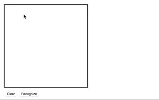

# regl-cnn

GPU accelerated handwritten digit recognition with [regl](https://github.com/mikolalysenko/regl).



# Implementation Details

This demo does handwritten digit recognition by evaluating a
Convolutional Neural Network on the GPU with WebGL. The network was
trained in TensorFlow [by this script](https://github.com/Erkaman/regl-cnn/blob/gh-pages/scripts/create_cnn.py), and the network was then
reimplemented on the GPU by hand with WebGL. The main purpose of the
demo was to demonstate how our WebGL framework
[regl](https://github.com/mikolalysenko/regl) can be used to greatly
simplify GPGPU programming in WebGL. The secondary purpose was to
test whether evaluating Deep Learning networks in WebGL is doable.  To
our knowledge, our implementation is the first implementation ever to
attempt GPU accelerating neural networks with WebGL And we hope that
this implementation will provide a foundation for people who, like us,
wish to experiment with Deep Learning and WebGL The GPU implementation
can be found [here](https://github.com/Erkaman/regl-cnn/blob/gh-pages/src/gpu.js)


# Build

```bash
npm install
```

To then run the demo, do

```bash
npm run start
```

To run the test cases, do

```bash
npm run test
```
